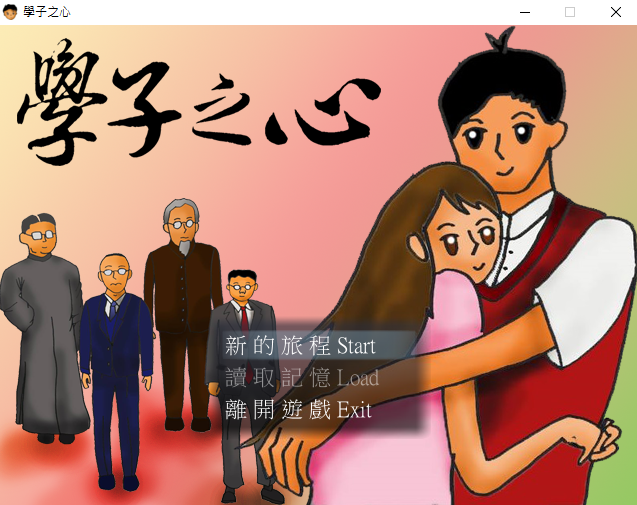
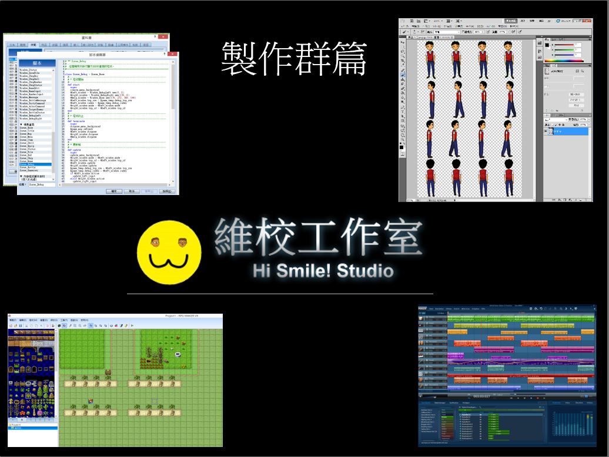
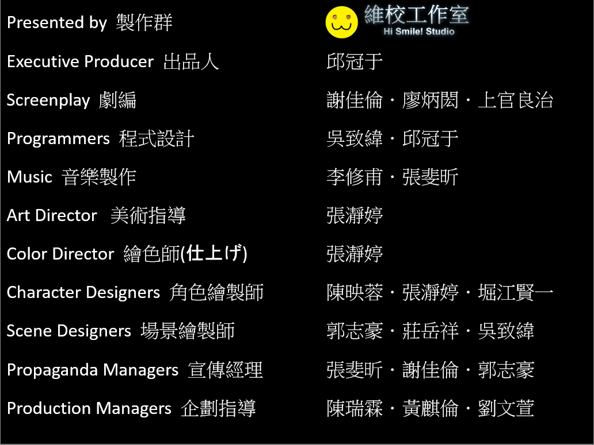
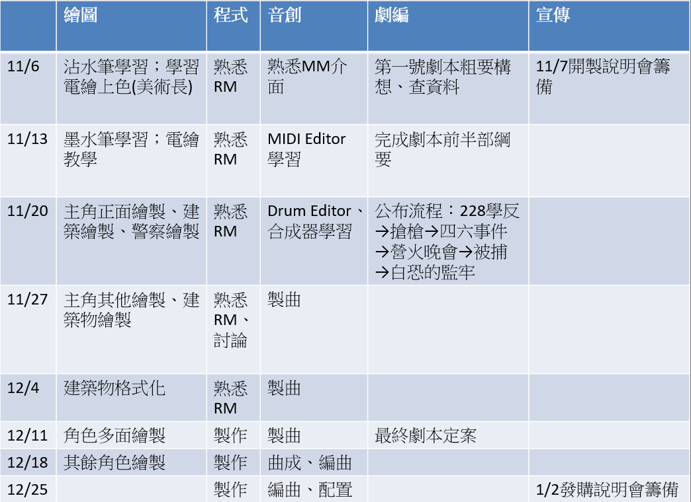
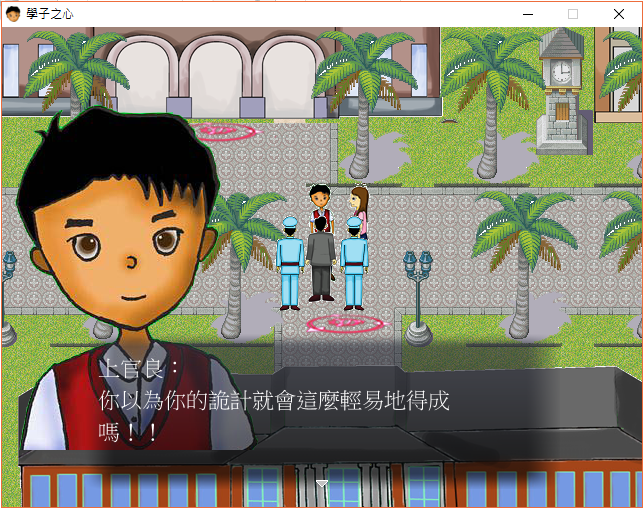
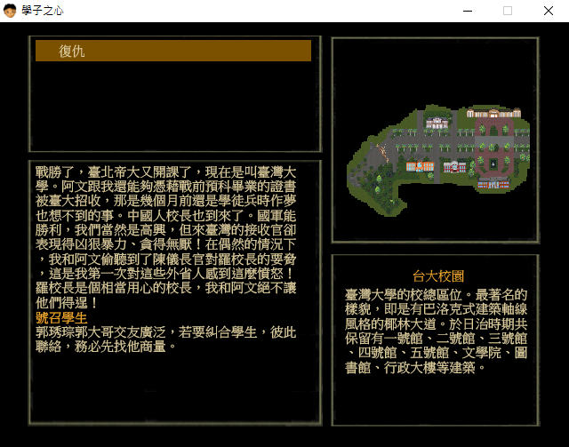

# 《學子之心》(The Heart of the Patriotic Students)

《學子之心》(The Heart of the Patriotic Students) is a game written by RPG Maker XP.

It's a RPG PC-Game. The story is about the four principals of National Taiwan University(NTU), and some historical events about NTU students.  

  

## Designers

This is my first handmade PC-Game.

I made this game when i was in NTU, with other classmates, in a class called 《校園資產詮釋計畫》(National Taiwan University Heritage Interpretations).  

They are 莊岳祥、上官良治、堀江賢一、張瀞婷、吳致緯、李修甫、廖炳閎、郭志豪、張斐昕、陳映蓉、謝佳倫.  

I had done most of the RPG Maker's design. Other classmates made most of the photos and a theme song.  

  

## GamePlay Snapshots

  

## Download

* Make sure you have RMXP RTP in you computer. If you don't, you can download [here](/Builds/xp_rtp104e.exe) 

* Download Link: [Installer](/Builds/《學子之心》1.01Installer.exe) or [Portable](/Builds/《學子之心》1.01Portable.exe) 

* You may need to turn off your antivirus software in order to execute.

  

## Source (Debug Version)

The debug version is in /RPGMakerGameDesign/Source.

You can download and open it by using RPG Maker XP 1.03 to see the design.  

I used RGSS(Ruby-like language) script in this game.  
